# Design and architecture
## Domain Model

The domain model contains **two** main entities:
- Author
- Cheep

The Author entity represents a user who can follow authors, forming a zero-to-many relationship. The latter extends from IdentityUser and therefore inherits attributes related to authentication.
The Cheep entity represents a post written by a single Author. Each cheep stores important information about itself, as seen in the diagram.


## Architecture

Our project adheres to an onion architecture, which splits the program into several layers. Each layer is responsible for a distinct part of the code such as the user interface, domain model or the infrastructure.

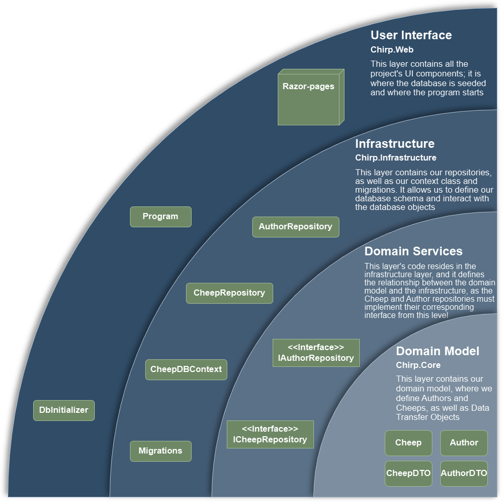

## Architecture of deployed application

The deployment diagram shows how the different nodes communicate with each other. Client A and Client B, representing the users' browsers, access the web-application, by sending HTTPS requests to the Azure web server. In case a user requests to authenticate via GitHub, the server sends an HTTPS request to GitHub, to retrieve the user's data. The server also maintains a connection to the integrated SQLite database within the application.

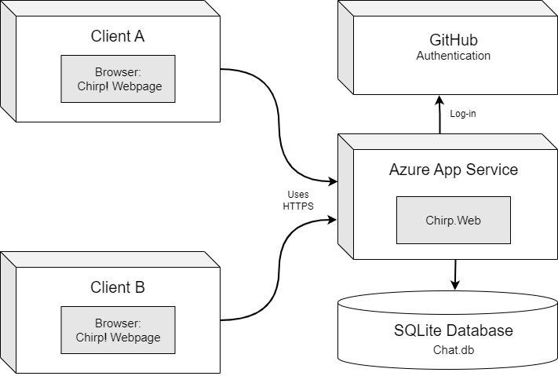

## User activities

A user activity diagram showing how an unauthorized user becomes an authorized user by registering as a user on Chirp!
<br />
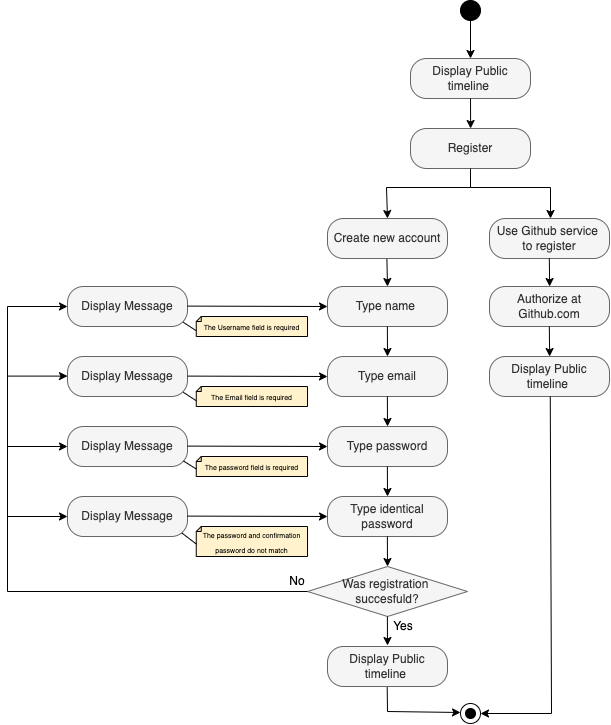


A user activity diagram showing how both authorized and unauthorized users can search for other users. This experience is the same for both types of users.
<br />
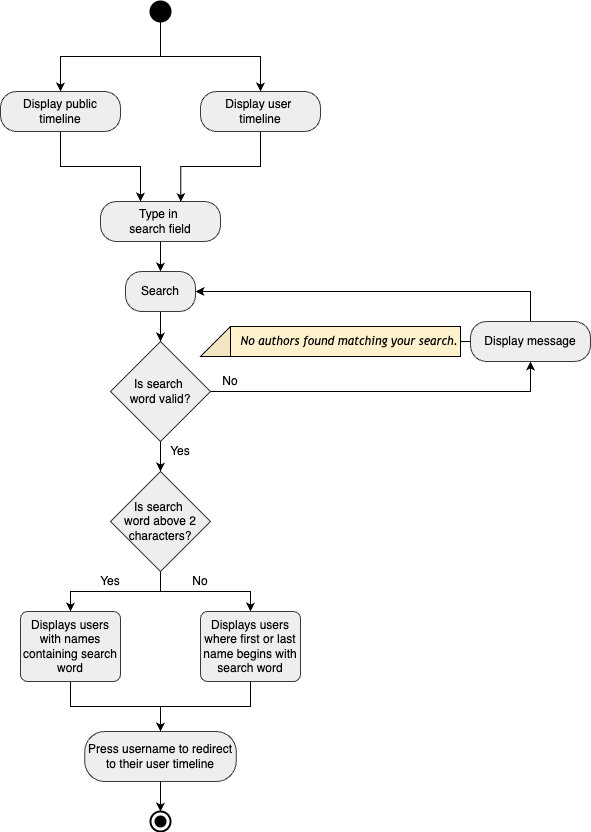


A user activity diagram showing a typical user journey of an authorized user liking and unliking a cheep.
<br />
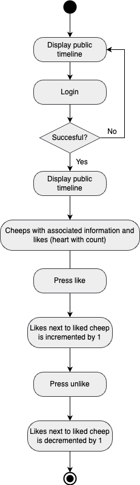


A user activity diagram showing a typical user journey of an authorized user writing and sharing a cheep.
<br />
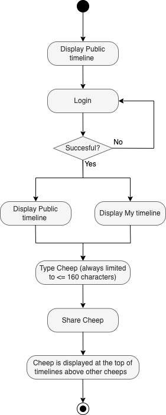


A user activity diagram showing a typical user journey of an authorized user following and unfollowing another user resulting in changes in the authorized user's private timeline.
<br />
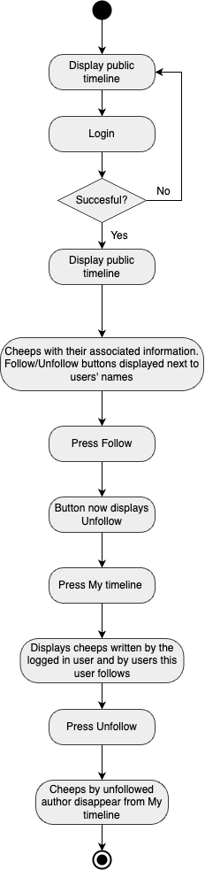


A user activity diagram showing a typical user journey of an authorized user deleting their account and data.
<br />
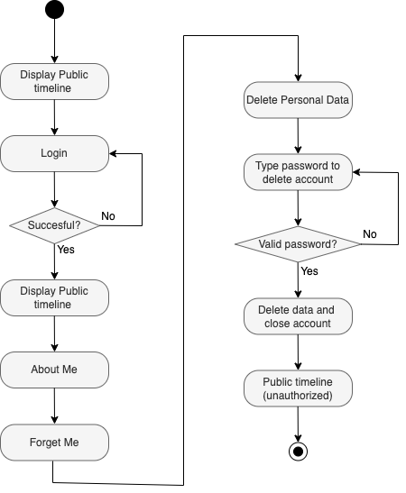


## Sequence of functionality/calls trough Chirp!

When an unauthorized or unregistered user runs the application, the web application calls the CheepRepository in Chirp.Infrastructure, which then queries the database to load a list of cheeps for the user to view on the public timeline.

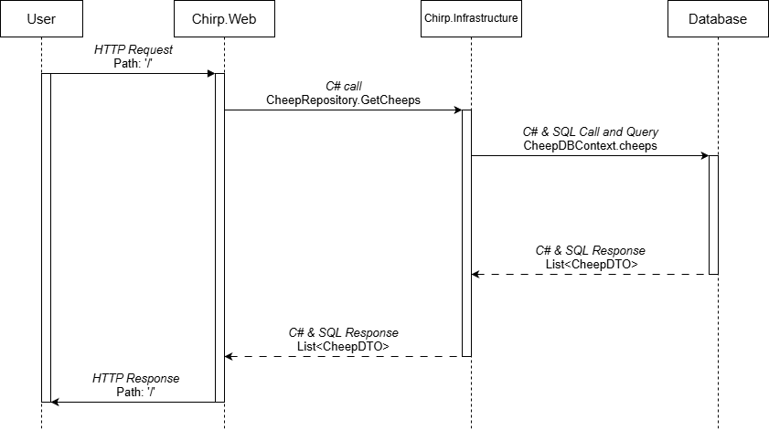

# Process

## Build, test, release and deployment
We are using three different workflows to automate processes such as building, testing, releasing and deploying to Azure.

### Build and test workflow
The build and test workflow runs when there is a push to main, or a merge through a pull request. It sets up the project (chooses correct .NET version and adds Playwright packages), builds the project, installs Playwright and finally tests **all** the tests in the solution.


### Release workflow
The release workflow runs on all branches, but only when pushed with a tag in the format of `v*.*.*`. It sets up the project (chooses correct .NET version), restores project dependencies and begins creating ZIP files containing the relevant files for each major operating system (Linux, macOS, Windows). This is done by using 'publish' and 'release' with the correct OS. In the end, the files are uploaded to GitHub.

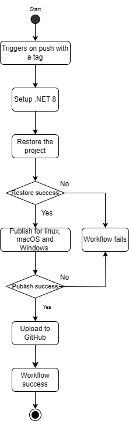


### Deployment workflow
The deployment workflow runs when a push has been made to main and runs in two segments **build** and **deploy**.
- **Build**
  It sets up the project (chooses correct .NET version), builds the project and publishes the application. The published file (called an artifact) is uploaded.

- **Deploy**
  The previously uploaded artifacts are downloaded, and the workflow logs in to Azure with the correct client-id, tenant-id and subscription-id. Lastly, the published file is deployed to the Azure Web App.

**Potential improvements**
In retrospect, some elements of the workflows could have been improved:
1. Run the release workflow every time a push is made to main, with a tag that is incremented automatically
2. Build and test on pushes to all branches, and not just to main.

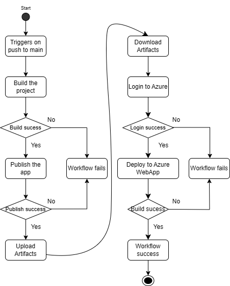

## Teamwork
Each week, we created issues describing the features, changes or process-related tasks we wanted or were required to add to the program.
We realize that we could have benefited from a few potential improvements in our teamwork, i.e. more consistent use of issues - creating and closing in real-time, formally assigning developers to issues every time instead of only verbally assigning them, and used the "Create branch" tool under each issue to link branches, issues and pull requests. This could have given us a better workflow, but overall our working process has worked really well for us.

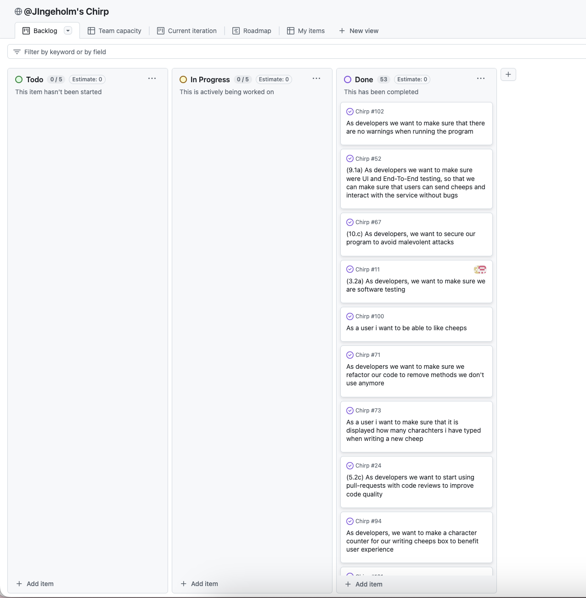

We used both mob programming, pair programming and solo programming depending on the tasks and the ability to delegate them.

We co-authored each other when working together, either by tagging or by simply writing it in our commits. However, we experienced that the co-authors' names were not added above the code in Rider.

### Flow of activities: from issue to main
The following flowchart illustrates how our group (16) created issues (light blue), developed solutions (middle blue), and merged the solutions into the main branch (dark blue). The flowchart shows how different decisions were made through the flow.

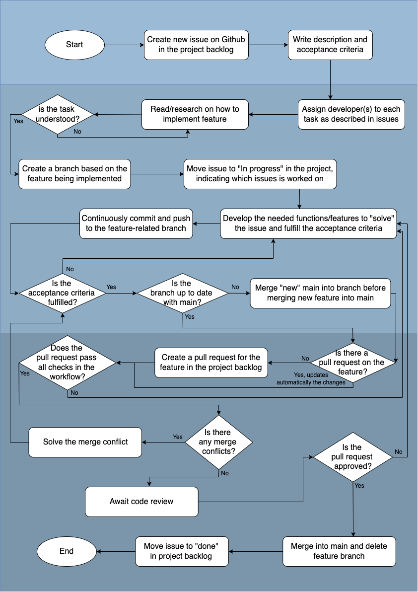


## Run Chirp! locally

Ensure that you have .NET 8 installed, since the application is using that version. If running on Windows, make sure to run the application in WSL.

1. Clone the git repository
    ```
    git clone https://github.com/ITU-BDSA2024-GROUP16/Chirp.git
    ```

2. Navigate to the correct directory
    ```
    cd Chirp/src/Chirp.Web
    ```
3. Insert correct clientID and clientSecret
    ```
    dotnet user-secrets init
    ```
    ```
    dotnet user-secrets set "Authentication_Github_ClientId" "Ov23lidu6tRWd2h4Rg2G"
    ```
    ```
    dotnet user-secrets set "Authentication_Github_ClientSecret" "7222f926351e557c77f53d98e775e5269ba4b1a2"
    ```
4. Run the application
    ```
    dotnet run
    ```

## Run tests locally

To run the test, follow this guide:

1. Open the solution
2. Navigate to the root folder
3. In the terminal, write the following command

    ```
    dotnet test
    ```


This will run **all** the tests, including unit-tests, integrations-tests and end-to-end tests using Playwright.

The unit-tests test individual functionalities such as retrieving an author from the database using the author's name.

The integration-tests test the interaction between the infrastructure layer and the web layer. This is done by making HTTP request, and ensuring that the HTTP response is correct e.g. creating a user and testing that they have a userTimeline.

The end-to-end tests test the functionalities of the user interface. Each test acts as a user going through the different features, and then checking (by using expect) if the features work as intended.

We have used Coverlet (A coverage framework for .NET) to show the coverage of our tests. Trivially, we wanted to achieve as much coverage as possible. As seen on the pictures, we have achieved 100% line coverage in both `Chirp.Core` and `Chirp.Infrastructure`. (Note, we removed migrations etc. from the coverage report, since it seems nonsense to test). On `Chirp.Web` we achieved 77.2% line coverage. This could have been improved, but that would mean testing a lot of the scaffolded classes which are native to .NET. 

For full coverage report, see appendix.

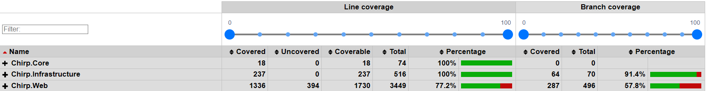


# Ethics

## License

The MIT license

## LLMs

For this project, we did occasionally use ChatGPT to help us in various ways, and we credited by co-authoring ChatGPT in the commits where it was relevant.

We mostly used ChatGPT as a TA to explain things, for debugging and to help us understand errors and the capabilities of C#. This was helpful at times and allowed us to more easily put our ideas to reality. The code and the structure of it, we wrote mainly ourselves. 

# Appenix

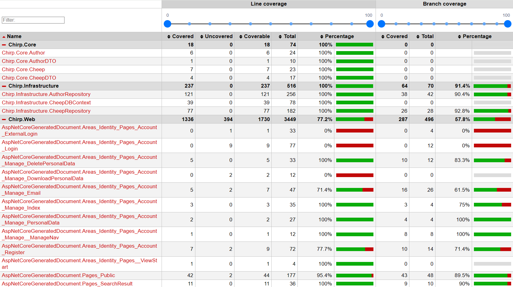
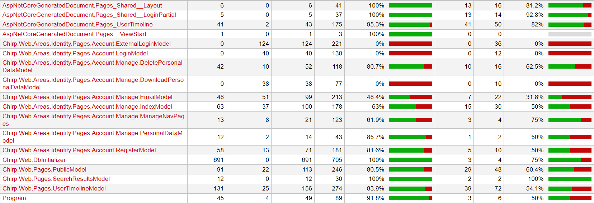